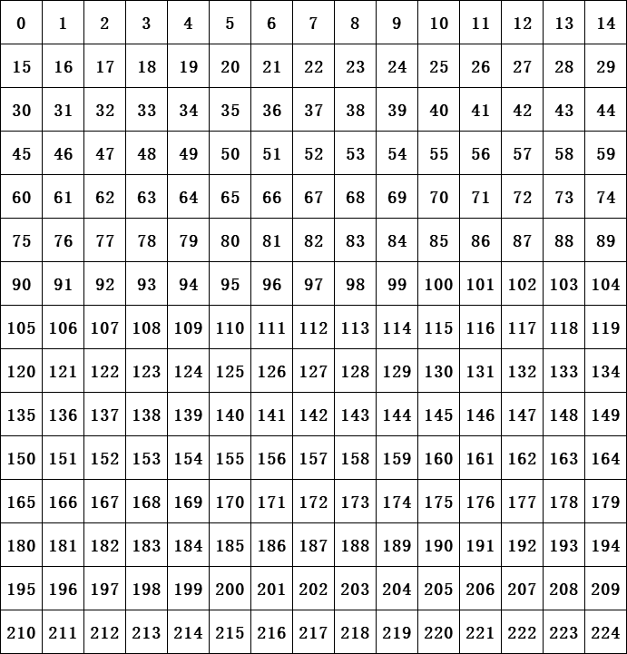

# Visual Basic .Net 实现的五子棋GUI

### 项目说明

- 本项目是使用 Visual Basic .Net 实现的五子棋人人对战、人机对战、机器人对战平台GUI，机器人程序位于同目录下的 RobotA.dll 或 RobotB.dll 中
- 欢迎C语言A班大神使用本项目调试运行自己的五子棋作业，**求个三连谢谢支持**（逃
- 本项目当前处于测试版本，如果遇到运行不稳定的情况，可以联系作者反馈

### 五子棋机器人作业的项目迁移指南

本段内容指引读者将【C语言A班】的【五子棋作业】改造为适宜的 dll 文件，使之可以在本项目中运行

- 备份初始版本的机器人，新建 dll 项目，将机器人的代码文件复制到该项目中
- 新建代码文件`InterfaceGUI.c`，将以下接口代码粘贴到该文件中

```c
enum PlayerColor
{
    PLAYER_BLACK = 0,
    PLAYER_WHITE = 1
};
enum ChessColor
{
    CHESS_EMPTY = 0,
    CHESS_BLACK = 1,
    CHESS_WHITE = 2
};

int _stdcall GetNextMove(int map[225], int move);
void _stdcall Reset();
void _stdcall SetColor(int color);
void _stdcall SetLevel(int level);

int _stdcall GetNextMove(int map[225], int move)
{
	return 0;
}
void _stdcall Reset()
{

}
void _stdcall SetColor(int color)
{

}
void _stdcall SetLevel(int level)
{

}
```

- 参考以下说明，根据自己的机器人代码，实现以上接口函数。如果没有实现某个功能，请将其接口函数留空。

  - `PlayerColor`：玩家所执颜色。为0表示当前玩家（机器人）执黑，为1表示当前玩家执白。

  - `ChessColor`：棋子颜色。为0表示没有落子，为1表示黑棋，为2表示白棋。

  - `GetNextMove`：获取下一步落子位置。参数map为 `int` 类型，长度为225（即15*15），存储棋盘信息，下标表示位置，内容表示棋子颜色。参数move表示最后一步落子位置。

    棋盘数组下标与位置的关系如下所示：

    
    
  - `Reset`：复原机器人。是否将该函数留空取决于机器人作者。
  
- `SetColor`：设置当前玩家执棋颜色。参数`color`的含义由`PlayerColor`定义。
  
- `SetLevel`：设置机器人的难度水平。参数`level`由机器人作者自由定义。也可不做任何定义，将函数留空。
  
- 新建模块定义文件`Source.def`，将以下代码粘贴到该文件中，以导出特定格式的 dll 入口点函数
```text
LIBRARY
EXPORTS
	GetNextMove = _GetNextMove@8
	Reset = _Reset@0
	SetColor = _SetColor@4
	SetLevel = _SetLevel@4
```

- 编译dll，重命名为`RobotA.dll`或`RobotB.dll`，移动至GUI程序同一目录下
- 检查GUI程序面板中是否显示“就绪”